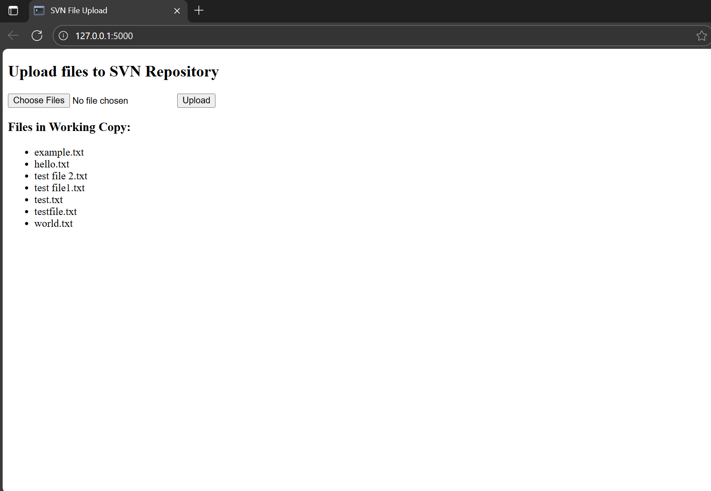
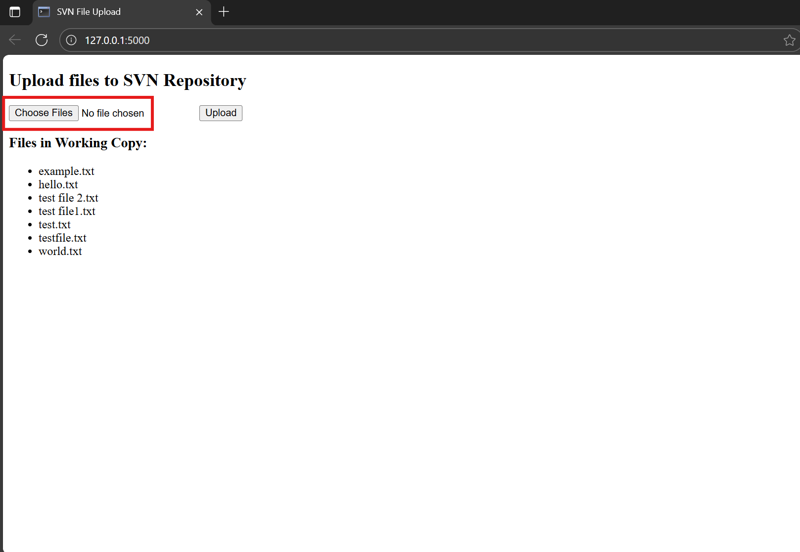
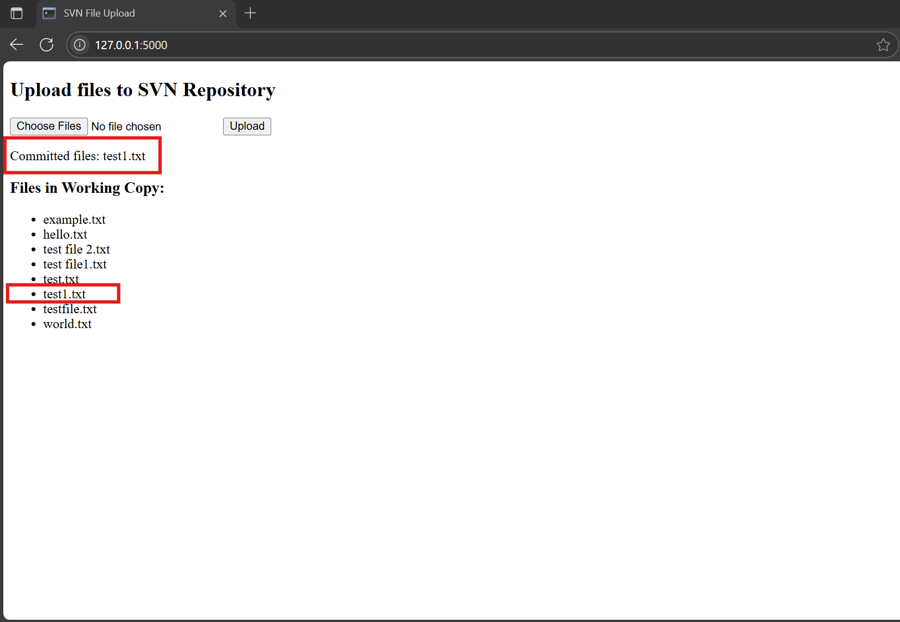

# flask-svn

This README demonstrates the common workflow for the Flask SVN app:

1. Create a new repository
2. Add a new file to the working copy
3. Commit the file to the repository

The server is assumed to run at `http://127.0.0.1:5000`.

# Using the Flask SVN App- Web GUI Instructions

This guide shows you and your users how to use the web interface of the Flask SVN app to upload files, commit changes, and view results **without using the command line**. The steps are simple and illustrated below so everyone can follow along.


## 1. Start the Flask SVN App

**Open your terminal (e.g., Command Prompt, PowerShell) and type:**

```
python __init__.py
```

*(or `flask run` depending on your setup)*

When the app is running, you’ll see messages like this:

* Running on http://127.0.0.1:5000

---


## 2. Open the App in Your Browser

**Go to:**
`http://127.0.0.1:5000/`

You’ll see a page like this:



---


## 3. Upload and Commit Files

**Step 1:**
Click the **Choose File** button (highlighted below).
Select one or more files that you want to add to the repository.




**Step 2:**
Click the **Upload** button.

---


## 4. Success and Confirmation

After uploading, you’ll see a success message:



The list just below the form shows all files currently in your working copy.
New files will appear here immediately after upload.

---


## 5. What Happens When You Upload?

- Your files are copied into the SVN working copy.
- They’re automatically added for versioning (no command line or technical steps needed).
- A commit is made with your message (or a default one).
- You’ll see your changes reflected right away.

---


## 6. Notes for New Users

- You **never need to use command line tools** if you prefer the GUI.
- Each upload is versioned and committed just like in any SVN client!
- Use the browser for all routine tasks: upload, view files, check status.

---


## 7. API / Command Line Reference

*(For advanced users, automation, or scripts, use the API/curl section below.)*

---

## Use Cases with Curl/API

*(For power users and automation, see below for the curl/API commands.)*

---

## 1.Creating a new repository

**Input**

```bash
curl -X POST http://127.0.0.1:5000/svn/create_repo \
     -H "Content-Type: application/json" \
     -d '{"repo_name":"myrepo"}'
```

**Output**

```json
{
  "message": "SVN repository and working copy are ready."
}
```

---

## 2. Adding a new file to the working copy

**Input**

```bash
curl -X POST http://127.0.0.1:5000/svn/add_file \
     -H "Content-Type: application/json" \
     -d '{"filename":"greeting.txt", "content":"Hello from the API!"}'
```

**Output**

```json
{
  "message": "Added to working copy (scheduled for commit).",
  "file_path": "C:\\svn\\myrepo_wc\\greeting.txt"
}
```

---

## 3. Committing the file to the repository

**Input**

```bash
curl -X POST http://127.0.0.1:5000/svn/commit \
     -H "Content-Type: application/json" \
     -d '{"message":"Initial greeting.txt commit"}'
```

**Output**

```json
{
  "message": "Committed with message: Initial greeting.txt commit"
}
```

---
